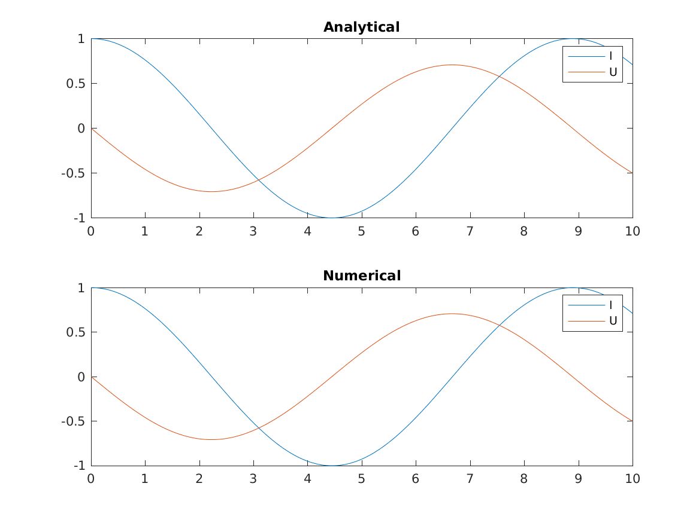

## Background

The purpose of this tutorial is to illustrate the usage of preCICE to couple MATLAB code. Two different MATLAB solvers will be coupled to simulate a two-element LC circuit. This type of circuit consists on a very simple system with one inductor and one capacitor:

![LC circuit diagram [1]](ref_images/diagram.svg)

The circuit is described by the following system of ODEs:

V(t) = L dI/dt

I(t) = -C dV/dt

where I is the current and V the voltage of the cirucit.

Each of these equations is going to be solved by a different MATLAB solver. Note that as only one scalar is solved per equation, this is a 0+1 dimensional problem.

## Dependencies

For running this tutorial, you have to install

* **preCICE**, see [preCICE wiki](https://github.com/precice/precice/wiki/Building).
* **MATLAB**, see [mathworks.com](https://de.mathworks.com/products.get-matlab.html).

After installing both preCICE and MATLAB, you need to [build the MATLAB bindings](https://github.com/gilbertolem/precice/tree/develop/src/precice/bindings/matlab#compilation).

## Running

There are two different versions available, one with explicit coupling and one with implicit coupling, located in the `explicit` and `implicit` folders respectively.

For running the case, first get into the desired folder (e.g. `explicit/`) and open two MATLAB instances. After adding the MATLAB bindings to the MATLAB path, run the following commands:

In the first MATLAB instance one can run the solver for the current:
```
Solver_I
```

And in the second MATLAB instance the solver for the voltage:
```
Solver_U
```

The preCICE configuration file is available as `precice-config.xml`, and it is called directly in the solvers.

### Running from terminal

If you prefer to not open the MATLAB GUIs, one can alternatively open two shells and:

Run solver for current in first shell:
```
# cd into desired folder (explicit or implicit)
cd explicit

# Add bindings to MATLAB path
export MATLABPATH=$PRECICE_ROOT/src/precice/bindings/matlab/

# Run matlab code without GUI
LD_PRELOAD=/usr/lib/x86_64-linux-gnu/libstdc++.so.6 matlab -nodisplay -nosplash -nodesktop -r "Solver_I;exit;"

```

Run solver for voltage in second shell:
```
# cd into desired folder (explicit or implicit)
cd explicit

# Add bindings to MATLAB path
export MATLABPATH=$PRECICE_ROOT/src/precice/bindings/matlab/

# Run matlab code without GUI
LD_PRELOAD=/usr/lib/x86_64-linux-gnu/libstdc++.so.6 matlab -nodisplay -nosplash -nodesktop -r "Solver_U;exit;"

```

## Visualization

The solver for the current also records the current and voltage through time and at the end of the simulation saves a plot with the obtained curves, as well as the analytical solution.

After successfully running the coupling, one can find the curves in their respective folder as `Curves.png`.



## References
[1] By First Harmonic - Own work, CC BY-SA 3.0, https://commons.wikimedia.org/w/index.php?curid=21991221